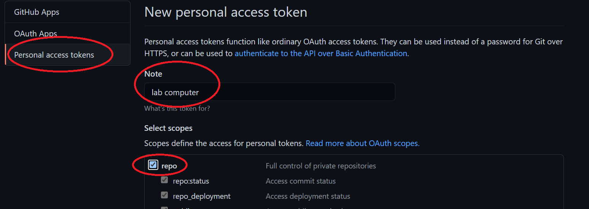
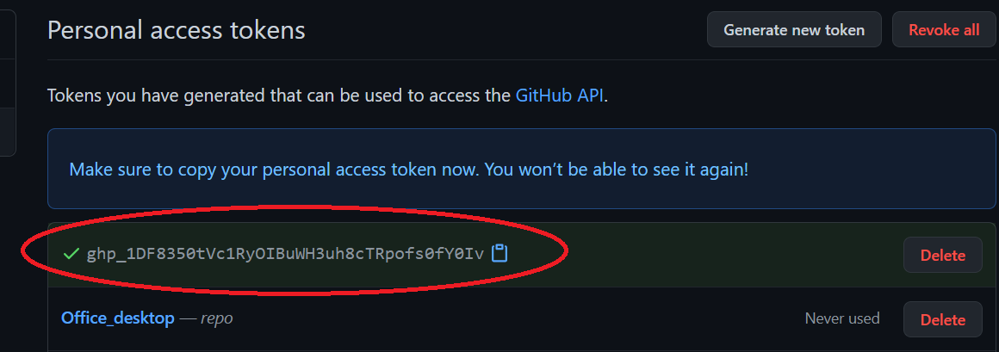
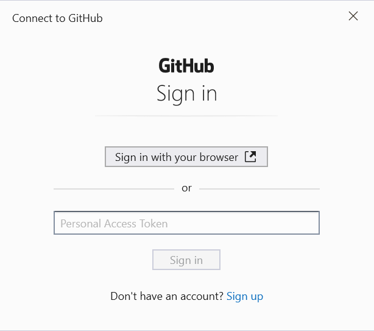
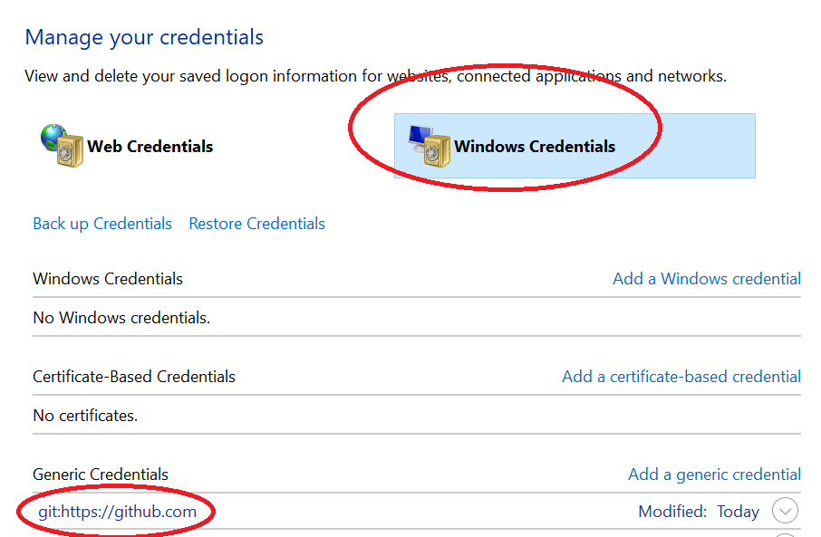

------

Prior to August 13, 2021, you were allowed to authenticate by typing a username and password every time you *pushed* or *pulled* from GitHub. For example, when pushing changes made in a local repo to GitHub, the session would look something like this:

```shell
$ git push
> Username for 'https://github.com': jdcolby
> Password for 'https://jdcolby@github.com': ******
```

Using your GitHub password is no longer allowed after [August 13, 2021](https://github.blog/2020-12-15-token-authentication-requirements-for-git-operations/). Instead, you need to adopt one of several authentication options. Two of these options are covered here: **Personal Access Token** (**PAT**) or **SSH-based** authentication. Both techniques require some degree of configuration on both your GitHub account and your local machine, but the PAT will be the easiest to set up for your students.

Note that your choice of authentication will be dictated by the way you connect to your GitHub repo. If you use PAT, you will connect to your repo over `HTTPS`--this is the connection used in this workshop.  If you use an SSH key, you will connect to your GitHub repo over `SSH`. 

For example, if `jdcolby` clones `repo1` from her GitHub account using `HTTPS`, she would type:

```shell
$ git clone https://github.com/jdcolby/repo1.git
```

If `jdcolby` clones that same `repo1` repository from her GitHub account using `SSH`, she would type:

```shell
$ git clone git@github.com:jdcolby/repo1.git
```

Instructions on setting up authentication using both techniques follow.


## Personal access token (PAT) based authentication

First, you need to follow these steps on GitHub:

1. Click on your avatar (upper right-hand corner) and select **Settings**.

2. On the left sidebar, click on **Developer** **settings** (this should be near the bottom of the left sidebar.

3. In the left sidebar, click **Personal access tokens**.

4. Click **Generate new token** (button near the upper left-hand side).
   
5. In the *Note* field, assign a name to this token such as the local computer you are creating this token for.

6. In the next field, you can set an expiration date for this token, or make it permanent. In this example, we'll set it for 90 days.

7. From the **scopes** menu, select *repo*. This will allow you to read/write to your repo.




7. Click **Generate token** at the bottom of the page.

8. **Copy** and **temporarily save** the token before closing the window. 


   
When copying the token id, be careful not to add any empty spaces to the beginning or end of the token. It might be a good idea to temporarily paste the token into a plain text editor.

   > Note that you will not be able to access the token string once you exit the window! You might want to keep this window open until you've completed the steps outlined next.

Once you've created your token on GitHub, you simply substitute your GitHub password with your access token. For example, if you are cloning a private repo that your account has access to, you would enter the above token instead of your GitHub password.

```
$ git clone https://github.com/jdcolby/repo.git
Username: jdcolby
Password: <your token>
```

When you paste your token, you will not see it displayed on the command line. This might lead you to believe that it did not paste. Do not attempt a re-paste since this will only add the token to the end of the already pasted token.

Pasting your token each time you push or pull from your repo may prove cumbersome after a while. It might therefore be best to cache your token. This step is OS specific and is highlighted in the next subsections.

### Saving tokens in Windows

If you are using a Windows based Git application, you might see the following window pop-up when you are first asked to enter your token.



If so, you can paste the token into the *Personal Access Token* field.

Alternatively, you can add a git setting via the Windows Bash environment as follows:

```shell
git config --global credential.helper wincred
```

>  Note that this `config` option only works in the **Git for Windows Bash** shell.  This option will *not* work in a Windows WSL Ubuntu environment. If you are using WSL Ubuntu, you need to follow the Linux instructions listed below.

The credentials get stored in Windows' **Credential Manager**. You can delete this stored credential by accessing the Credential Manager via **Control Panel >> All Control Panel Items >> Credential Manager**  or by simply typing *Credential Manager* in the Windows' task bar.




### Saving tokens in Mac

You'll need the **OSX keychain credential helper**.  If you installed Git using Homebrew or via the *Xcode* command line, then *osxkeychain* helper should be part of the installation.

You can check for its installation via the following command:

```shell
$ git credential-osxkeychain
```

To have Git store the token in *osxkeychain*, type:

```shell
$ git config --global credential.helper osxkeychain
```

The next time you are prompted for a user name and password, simply type your GitHub account name, then your personal access token. This will be a one time operation after which the token will be permanently stored. 

Click [here](https://docs.github.com/en/github/getting-started-with-github/getting-started-with-git/updating-credentials-from-the-macos-keychain) to for more information on using *Keychain* with Git.


### Saving tokens in Linux

To temporarily cache the token on Linux, use the following command:

```shell
$ git config --global credential.helper cache
```

Note, however, that the token is only cached for 15 minutes by default. If you want the token to be cached for a longer period of time, add the `'cache --timeout=XX\'` option where XX is time in seconds. For example, to cache the token for 24 hours (86,400 seconds), type:

```shell
$ git config --global credential.helper 'cache --timeout=86400'
```

To **permanently** cache the token on Linux, type: (https://stackoverflow.com/a/12240995):

```shell
$ git config credential.helper store
```

The next time you are prompted for your GitHub user name and token, the information will be stored permanently in a `.git-credentials` file under your `home` folder. Note, however, that this file is **not encrypted**. For a more secure permanent solution, you might want to check the *SSH based authentication* option.

## SSH based authentication

>  NOTE: If you adopt an SSH based approach to authentication, you will need to connect to your repo via `ssh`. For example, if  user `jdcolby`'s repo name is `repo1`, you would connect to it via:

```shell
$ git@github.com:jdcolby/repo1.git
```

> This differs from the HTTPS option adopted in this workshop:

```shell
$ https://github.com/jdcolby/repo1.git 
```


### Checking for existing SSH keys

You might or might not already have public keys under `~/.ssh` file. 

```shell
$ ls -al ~/.ssh
```

If you do, look for the files ending with `.pub`. The contents of these public keys are used to link your local repos to your GitHub account. By default, the filenames of the public keys are one of the following: `id_ed25519.pub` or `id_rsa.pub`.  If these files exist in your `~/.ssh` folder, you can jump to the [Adding SSH key to your GitHub account](#Adding SSH key to your GitHub account) section of this tutorial.

### Generating a new SSH key

In your Bash shell, type the following (note that the email address should be the one tied to your GitHub account). For example, `jdcolby` would type the following:

```shell
$ ssh-keygen -t ed25519 -C "jdcolby@my_college.edu"
```

```shell
Generating public/private ed25519 key pair.
Enter file in which to save the key (/home/jdcolby/.ssh/id_ed25519):
```

This creates a new SSH key, using the provided email as a label. Accept the default file location and press the `Enter` key.

At the prompt, type a secure passphrase.  This passphrase will be used instead of your password when performing a Git/GitHub transaction from your computer, so don't forget it!

```shell
> Enter passphrase (empty for no passphrase): [Type a passphrase]
> Enter same passphrase again: [Type passphrase again]
```

You will then see an output similar to this:

```
Your identification has been saved in /home/jdcolby/.ssh/id_ed25519
Your public key has been saved in /home/jdcolby/.ssh/id_ed25519.pub
The key fingerprint is:
SHA256:AuErG+8I8YUkRbNn1iNiGB/T3P6p4oWtmHA821i3bPO jdcolby@my_college.edu
The key's randomart image is:
+--[ED25519 256]--+
|    ..o.o        |
|.o . o o o       |
|o O o . o .    . |
|.* * o . .  . o  |
|*++ + . S  . E   |
|**oo   .    . .  |
|*++.    .    o   |
|o=o.     . .o.   |
|+o.       ..o..  |
+----[SHA256]-----+
```


### Adding the SSH key to the ssh-agent process

Next, you need to add the previously generated key to a process called `ssh-agent`. 

#### Windows and Linux

```shell
$ eval "$(ssh-agent -s)"
$ ssh-add ~/.ssh/id_ed25519
```

You'll then be prompted to enter the passphrase used in the earlier step.

```
Enter passphrase for /home/jdcolby/.ssh/id_ed25519:
Identity added: /home/jdcolby/.ssh/id_ed25519 (jdcolby@my_college.edu)
```

#### Mac

```shell
$ eval "$(ssh-agent -s)"
```

Edit (or create it if non-existent) the `~/.ssh/config` file by adding the following lines of code.

```
Host *
  AddKeysToAgent yes
  UseKeychain yes
  IdentityFile ~/.ssh/id_ed25519
```

Next, add the key to the `ssh-agent`. Note the use of the `-K` option.

```shell
$ ssh-add -K ~/.ssh/id_ed25519
```

### Adding SSH key to your GitHub account

Now that you've completed the step on your computer, you will will  switch to your GitHub account. But before you do, you will need to copy the SSH public key generated on the previous step to your clipboard. 

In `~\.ssh` you should see a file ending with `.pub` such as `id_ed25519.pub`. This is the **public** key generated earlier in this tutorial that you will share with your GitHub account.

Open the contents of the `~/.ssh/id_ed25519.pub` file in your home folder. 

```shell
$ cat ~/.ssh/id_ed25519.pub
```

Copy its contents. It should start with `ssh-ed5519 ...` and end with your email address. 

- On **GitHub**, click on your avatar,  then select **Settings**.
- On the left sidebar, click on **SSH and GPG keys**.
- Click on **New SSH** **key**. 
- Assign a *Title* for this key (this is only used for your reference but is should be descriptive enough for you to know which client computer it is referencing).
- Paste the key from the `.ssh/id_ed25519.pub` file in the *Key* field (be careful not to add empty spaces).
- Click **Add SSH** key. You might be prompted to type your GitHub password.

Next, you can test your connection from your Bash environment. 

In Bash, type the following (*do not* substitute the `git@github.com` address).

```shell
 $ ssh -T git@github.com
```

You might see the following warning (including the public key as shown below):

```shell
The authenticity of host 'github.com (140.82.114.3)' can't be established.
RSA key fingerprint is SHA256:nThbg6kXUpJWGl7E1IGOCspRomTxdCARLviKw6E5SY8.
Are you sure you want to continue connecting (yes/no/[fingerprint])?
```

Type `yes` to continue.

The next warning  should list your account name (e.g. `jdcolby` in this working example).

```
Warning: Permanently added 'github.com' (RSA) to the list of known hosts.
Hi jdcolby! You've successfully authenticated, but GitHub does not provide shell access.
```

### Cloning a GitHub repo using SSH

At this point, you should be all set. As mentioned at the beginning of this page, when using SSH to connect to your GitHub repo,  you need to use the SSH protocol. For example, to clone `repo1`, you would type:

```shell
$ git clone git@github.com:jdcolby/repo1.git
```

You might be prompted for the passphrase  that was used in an earlier step when you created the SSH key.

### Converting an existing HTTPS local repo to SSH

If you've already cloned a repo using HTTPS on your local computer, you will need to make a few changes to your local repo before benefitting from the SSH system. 

First, check that you are indeed using HTTPS:

```shell
$ git remote -v
```

```
origin  https://github.com/jdcolby/repo1.git (fetch)
origin  https://github.com/jdcolby/repo1.git (push)
```

To change from a HTTPS URL to a SSH URL, type:

```shell
$ git remote set-url origin git@github.com:jdcolby/repo1.git
```

### Avoiding the need to enter a passphrase

If you do not wish to type your passphrase every time you perform a Git/GitHub transaction you can try one of the suggested methods below for your OS.

#### Windows and Linux

You need to instruct Bash to launch ` ssh-agent` every time you start a new Bash session. One approach is to  edit (or create if non existent) `~/.bashrc` by adding the following lines:

```shell
env=~/.ssh/agent.env

agent_load_env () { test -f "$env" && . "$env" >| /dev/null ; }

agent_start () {
    (umask 077; ssh-agent >| "$env")
    . "$env" >| /dev/null ; }

agent_load_env

# agent_run_state: 0=agent running w/ key; 1=agent w/o key; 2= agent not running
agent_run_state=$(ssh-add -l >| /dev/null 2>&1; echo $?)

if [ ! "$SSH_AUTH_SOCK" ] || [ $agent_run_state = 2 ]; then
    agent_start
    ssh-add
elif [ "$SSH_AUTH_SOCK" ] && [ $agent_run_state = 1 ]; then
    ssh-add
fi

unset env
```

Once saved, every time you fire up a new Windows Bash session, you'll be prompted for this passphrase at the beginning of the session at which point you will no longer be requested to enter the passphrase.

#### Mac

On most recent versions of Mac you will probably be prompted to save the passphrase to your Mac keychain, if not, you can add the following lines to your `~/.ssh/config` file:

```shell
Host *
  AddKeysToAgent yes
  UseKeychain yes
  IdentityFile ~/.ssh/id_ed25519
```


-----

[Back to the home page](index.html)

<div class="footer">
<hr/>
<a rel="license" href="https://creativecommons.org/licenses/by-nc/4.0/"></a>  Manny Gimond (2021)
</br>


