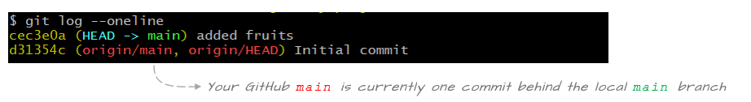
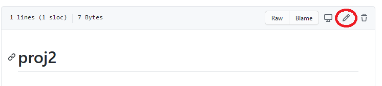

# Exploring syncing scenarios between local and remote repositories

[TOC]
------

In this tutorial you will learn how to keep a local repo synced with its GitHub counterpart. You will work off of the `proj2` repo created in a [previous](github_setup.md) tutorial.

## Check the repo's status

Let's first check that our repo has nothing to commit and that it's in sync with the GitHub repo.

```BASH
$ git status
```

```
On branch main
Your branch is up to date with 'origin/main'.

nothing to commit, working tree clean
```

The message indicates that there is nothing to commit. It also indicates that it's in sync with with GitHub counterpart via the `Your branch is up to date with 'origin/main'` message. 

Recall that the handle `origin` points to the GitHub repo. To confirm this, simply type:

```BASH
git remote -v
```

```
origin  https://github.com/jdcolby/proj2.git (fetch)
origin  https://github.com/jdcolby/proj2.git (push)
```

Now let's check the log.

```BASH
$ git log --oneline --all
```

```
d31354c (HEAD -> main, origin/main, origin/HEAD) Initial commit
```

It shows an existing commit. This was not created by us in our local repo. It was created by GitHub when we initially setup the repo on the web page. This commit includes the addition of the README file.

The log has a few more elements not present in an earlier tutorial where we were working exclusively in a local git repo. This log adds `origin/main` and `origin/HEAD`. Recall that `origin` is a handle to the remote GitHub repo. `origin/main` is the `main` branch on the remote repo and `origin/HEAD` is the active branch on the remote repo.


The log indicates that the local and remote `main` branches are in sync. It also indicates that the local and remote `HEAD`s are pointing to the tip of their respective branches.

## Create a local commit

Next, you will create a local commit by adding a file called `fruits.txt`. Populate the file with the following items.

```
apple
grapes
mango
```

Once the file is saved, stage and commit it.

```BASH
$ git add fruits.txt
$ git commit -m "added fruits"
```

Now let's check the status:

```BASH
$ git status
```

```
On branch main
Your branch is ahead of 'origin/main' by 1 commit.
  (use "git push" to publish your local commits)

nothing to commit, working tree clean
```

The output indicates that all changes in this repo were properly committed, but it also indicates that our local repo is no longer in sync with its GitHub counterpart. It's stating that our local repo is ahead of the remote repo by one commit.

Another way to view the disconnect between the local an remote repos is to view the log.

```BASH
$ git log --oneline 
```

```
cec3e0a (HEAD -> main) added fruits
d31354c (origin/main, origin/HEAD) Initial commit
```



It's important to note that staging and committing changes in a local repo does *not* update the remote repo. In fact, you can work on a local repo and commit changes for days on end without affecting the remote repo.  

Next, you will learn how to update the remote repo.

## Update the remote repo:`push`

To push changes made locally to the remote repo, type:

```BASH
$ git push
```

Depending on how you have your authentication environment setup, you may or may not be prompted for a username/passphrase.

You'll see a status message similar to the following:

```
Enumerating objects: 4, done.
Counting objects: 100% (4/4), done.
Delta compression using up to 4 threads
Compressing objects: 100% (2/2), done.
Writing objects: 100% (3/3), 294 bytes | 294.00 KiB/s, done.
Total 3 (delta 0), reused 0 (delta 0), pack-reused 0
To https://github.com/jdcolby/proj2.git
   d31354c..cec3e0a  main -> main
```

Let's check the status.

```BASH
$ git status
```

```
On branch main
Your branch is up to date with 'origin/main'.

nothing to commit, working tree clean
```

The message indicates that the local branch is in sync with its remote counterpart. Let's check the log:

```BASH
$ git log
```

```
cec3e0a (HEAD -> main, origin/main, origin/HEAD) added fruits
d31354c Initial commit
```

You'll note that we did not add a commit. The only thing that has changed is the sync status. Both `main` branches are now in sync.

## Create a commit on GitHub

A typical workflow involves making changes to a local repo, then pushing that repo to its remote counterpart on a regular basis. In other words, the local repo is more likely to find itself ahead of the remote repo regularly. 

However, there may be times when the remote repo is ahead of your local repo. This can happen if you are working off of the remote repo from  two different computers. For example, you might have a local copy of the repo in your work office and another local copy in your home office.  You make changes to the local office repo then push it to the remote repo. This will set you home repo behind the remote repo.

Another scenario that can cause the remote repo to be ahead of the local repo is one where a collaborator is contributing to the remote repo.

In the example that follows, we'll create a scenario where the remote repo will be ahead of the local repo. We'll do this by simply editing a file directly in GitHub.

Go to your GitHub `proj2` repo page . Make sure to refresh the page to see all recent changes made to the repo.

Click on the `README.md` file.


Click on the pencil icon to the right of the window to enter edit mode.



The README file is in a markdown format. Edit the text as follows:

```
# Proj 2 repo

This is a test repo used to explore different syncing scenarios
```

A the bottom of the page, you have the opportunity to add a commit message before committing the changes. Note that the staging process is taken care of on the GitHub page.

We'll keep the default commit message and click on the `Commit changes` button.


## Update the local repo: `pull`

Now go back to your local repo Bash shell and check its status.

```BASH
$ git status
```

```
On branch main
Your branch is up to date with 'origin/main'.

nothing to commit, working tree clean
```

The status suggests that everything is up to date. But this is misleading. The `status` function does not actively check the state of the remote repo. We need to **sync** the **remote log** with out local repo.

```BASH
$ git fetch
```

Now let's check the status again.

```BASH
$ git status
```

```
On branch main
Your branch is behind 'origin/main' by 1 commit, and can be fast-forwarded.
  (use "git pull" to update your local branch)

nothing to commit, working tree clean
```

The message now properly recognizes that the remote repo is ahead by one commit. We can check the log as well. Make sure to add the `--all` option to see the changes in the remote branch.

```BASH
$ git log --oneline --all
```

```
5453d2a (origin/main, origin/HEAD) Update README.md
cec3e0a (HEAD -> main) added fruits
d31354c Initial commit
```


To update the local repo, run the `pull` command

```BASH
$ git pull
```

Now check the log.

```BASH
$ git log --oneline --all
```

```
5453d2a (HEAD -> main, origin/main, origin/HEAD) Update README.md
cec3e0a added fruits
d31354c Initial commit
```

Both repos are now in sync.

## Adding a branch

Let's add a branch called `feedback` to the local repo. 

```BASH
$ git branch feedback
$ git checkout feedback
```

Let's check the log.

```BASH
$ git log --oneline
```

```
5453d2a (HEAD -> feedback, origin/main, origin/HEAD, main) Update README.md
cec3e0a added fruits
d31354c Initial commit
```

We have not made any changes to the repo, so both local branches (`main` and `feedback`) are pointing to the same commit. GitHub's `origin/main` is also pointing to the same commit. But note that we do not see an `origin/feedback` branch on GitHub.  

To confirm that a feedback branch is not present in our remote repo, we can run the branch command with the `-r` branch.

```BASH
$ git branch -r
```

```
  origin/HEAD -> origin/main
  origin/main
```


We have yet to push this new branch to the remote repo.  We can do this later, after adding a few commits to `feedback`, or we can do this now. We'll opt for the latter option.

```bash
$ git push -u origin feedback
```

Now let's view the remote branches.

```BASH
$ git branch -r
```
```
  origin/HEAD -> origin/main
  origin/feedback
  origin/main
```
The log will now show the `origin/feedback` branch.

```BASH
$ git log --oneline --all
```
```
5453d2a (HEAD -> feedback, origin/main, origin/feedback, origin/HEAD, main) Update README.md
cec3e0a added fruits
d31354c Initial commit
```
## Creating a push conflict
In this next exercise, we will create a conflict whereby changes will be made to both the local repo and the remote repo before attempting to sync the two via a `push`.

### Modify the local `feedback` branch

First, we'll edit the `fruits.txt` file in the `feedback` branch by replacing the `mango` fruit with `pear`.
```
apple
grapes
pear
```
Stage and commit the change.
```BASH
$ git add fruits.txt
$ git commit -m "replaced mango with pear"
```

### Modify the remote `feedback` branch

Next, we'll modify the `fruits.txt` file on the remote `feedback` branch. We'll do this using the GitHub editor.

Go to  your GitHub's account's `proj2` repo page. Make sure to refresh the page to view the `feedback` branch.

From the **branch** pull-down menu, click on `feedback`.


This will place you in the remote `feedback` branch.

Click on the `fruits.txt` file.

Launch the editor mode by clicking the pencil icon near the right-hand side of the window. 

Add `peach` to the list of fruits. When done, the `fruits.txt` file should look like this:

```
apple
grapes
mango
peach
```

At the bottom of the *Editor* page, type `Added peach` as the commit message then click on **Commit changes**.


### Fixing conflict between remote and local repo

We now have separate commits made to the local and remote repos. We will first attempt a push from the local repo.

```BASH
$ git push
```

```
To https://github.com/jdcolby/proj2.git
 ! [rejected]        feedback -> feedback (fetch first)
error: failed to push some refs to 'https://github.com/jdcolby/proj2.git'
hint: Updates were rejected because the remote contains work that you do
hint: not have locally. This is usually caused by another repository pushing
hint: to the same ref. You may want to first integrate the remote changes
hint: (e.g., 'git pull ...') before pushing again.
hint: See the 'Note about fast-forwards' in 'git push --help' for details.
```

The `push` failed. Lets check the log.

```BASH
$ git log --oneline --all
```

```
8b16ed7 (HEAD -> feedback) replaced mango with pear
5453d2a (origin/main, origin/feedback, origin/HEAD, main) Update README.md
cec3e0a added fruits
d31354c Initial commit
```

The log does not yet know that changes have been made to the remote repo. As with the `status` command, the `log` command does not automatically check for updates on GitHub. We need to once again call the `fetch` command to update changes made remotely.

```BASH
$ git fetch
```

```BASH
$ git log --oneline --all
```

```
8b16ed7 (HEAD -> feedback) replaced mango with pear
e1ebf63 (origin/feedback) Added peach
5453d2a (origin/main, origin/HEAD, main) Update README.md
cec3e0a added fruits
d31354c Initial commit
```

We now see the two distinct commits: `8b16ed7` created in our local repo and commit `e1ebf63` created in our remote repo (recall that your hash ID will differ from those shown here).

To resolve the conflict, we need to `pull` the changes made on GitHub then integrate them as needed in our current repo. The best case scenario is one where the file or files modified on the remote repo are not those modified locally. Unfortunately, this is not the case in our current scenario given that both repos modified the same file (`fruits.txt`). This conflict will be reflected in the following message.

```BASH
$ git pull
```

```
Auto-merging fruits.txt
CONFLICT (content): Merge conflict in fruits.txt
Automatic merge failed; fix conflicts and then commit the result.
```

The attempted `pull` was not without a change to our local repo. The `fruits.txt` file was modified locally following the merge, but it was not committed. It's awaiting out manual intervention.

Open the local `fruits.txt` file in a Bash editor such as *vim* or *nano*, or open it in a GUI text editor.

```
apple
grapes
<<<<<<< HEAD
pear

=======
mango
peach
>>>>>>> e1ebf63873a5565dab5cda5d1759d210d5a1693f
```

Markers were added to the file. They are showing the  state of the file In our current `HEAD` and that in the file on GitHub (note that the log output lists the hash id starting with `e1ebf63` as the commit id associated with`origin/feedback` ).

Everything between `<<<<<<< HEAD` and  `=======` is what we currently have in our local `feedback` branch.  (note that an empty line was added in this example).

```
<<<<<<< HEAD
pear

=======
```

Everything between `======= ` and  `>>>>>>> e1ebf63...` is what we currently have on GitHub's `origin/remote` branch.

```
=======
mango
peach
>>>>>>> e1ebf63873a5565dab5cda5d1759d210d5a1693f
```

We now need to decide how we want to fix this conflict. We'll go ahead and remove `mango` and keep the `peach`. The file should look like the following when done (don't forget to remove the markers).

```
apple
grapes
pear
peach
```

We now need to stage then commit the fix.

```BASH
$ git add fruits.txt
$ git commit -m "fixed pull conflict"
```

Let's check the status to make sure that the conflict has been fixed.

```BASH
$ git status
```

```
On branch feedback
Your branch is ahead of 'origin/feedback' by 2 commits.
  (use "git push" to publish your local commits)

nothing to commit, working tree clean
```

The merge conflict seems to have been fixed. But the commits do not seem to be in sync. Let's check the log.

```BASH
$ git log --oneline --all 
```

```
ff88a08 (HEAD -> feedback) fixed pull conflict
8b16ed7 replaced mango with pear
e1ebf63 (origin/feedback) Added peach
5453d2a (origin/main, origin/HEAD, main) Update README.md
cec3e0a added fruits
d31354c Initial commit
```

Our current `HEAD` of the `feedback` branch is ahead by two commits from the remote `feedback` branch. The remote branch is missing the most recent fix made to the conflict (commit `ff88a08` in this example), but it's also missing the local `8b16ed7` commit. 

All we need to do now is to rerun the push.

```BASH
$ git push
```

Let's check the log.

```
ff88a08 (HEAD -> feedback, origin/feedback) fixed pull conflict
8b16ed7 replaced mango with pear
e1ebf63 Added peach
5453d2a (origin/main, origin/HEAD, main) Update README.md
cec3e0a added fruits
d31354c Initial commit
```

Our local `feebdack` branch is now in sync with the remote `feedback` branch. Don't forget to refresh the GitHub page to see the changes there.


## Final exercise

As a final exercise, you will merge the changes made in `feedback` into the `main` branch in your local repo. You will then push the changes to the remote repo.

```BASH
$ git checkout main
$ git merge feedback
```

At this point, your log should look like this:

```ff88a08 (HEAD -> main, origin/feedback, feedback) fixed pull conflict
ff88a08 (HEAD -> main, origin/feedback, feedback) fixed pull conflict
8b16ed7 replaced mango with pear
e1ebf63 Added peach
5453d2a (origin/main, origin/HEAD) Update README.md
cec3e0a added fruits
d31354c Initial commit
```

Your local `main` and `feedback` branches are now at the same commit. The remote repo has yet to be updated.

```BASH
$ git push
```

All branches, local and remote, should now be in sync.

-----

[Back to the home page](index.html)

<div class="footer">
<hr/>
<a rel="license" href="https://creativecommons.org/licenses/by-nc/4.0/"></a>  Manny Gimond (2021)
</br>

