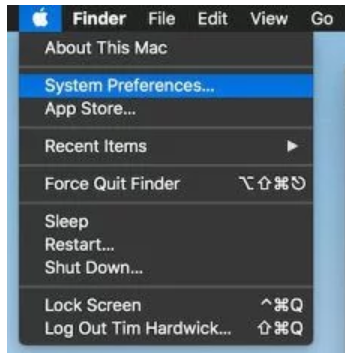
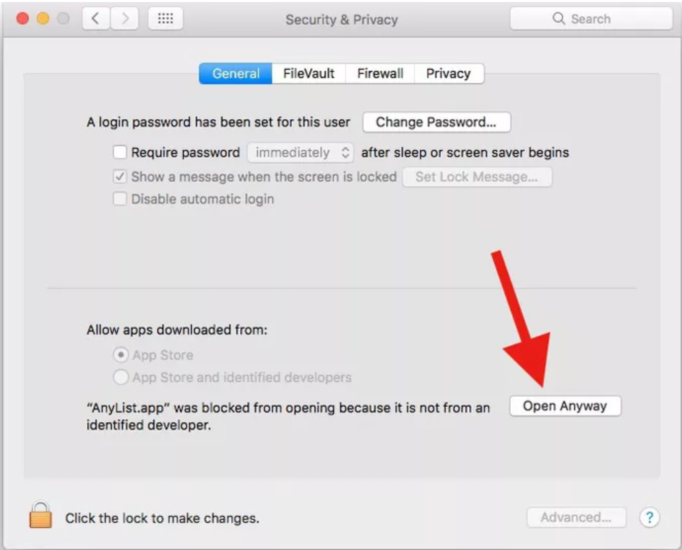

Some students experienced issues installing Git on their Macs this past year. This solution seems to have worked.

If this happens go to *Systems preferences* and click on *Security and privacy settings*.

The *Security and privacy settings* should be the 6^th^  option down the first row.

Once you click on "Security and Privacy", you're brought to the screen shown below with the option to download the software/app from the unidentified developer. Click on "Open Anyway" and you should be good to go.

