# Using GitHub in your classroom

[TOC]

----

To use GitHub in your course, you will need:

* A GitHub account for yourself and for each student;
* A **GitHub organizational** account that will house your course repos (this is a separate space from your personal GitHub repo);
* A **GitHub Classroom** account used to manage your classroom assignments. Note that this is accessed via https://classroom.github.com/.

The first step is to setup the GitHub account for your course. 

## Initial setup

### Creating a new organization for your course

In this exercise, you will create a new organization account for your course.  In the steps that follow, we'll assume that the user `jdcolby2` is the instructor.

* Log into your GitHub account
* In the upper right-hand corner of the web page, click on the `+` pulldown menu and select **New organization**.
  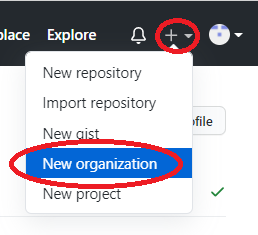
* If you are prompted to pick a plan for your organization, pick the **Free** option.
* In the *Set up your organization* page, create your organization name. Adopt a naming convention that will be systematic. For example, we'll name this account `colby-git123-fa2021`.
* Add your contact email and the account (yours) associated with this organization. You may also be prompted to verify that you are not a *robot* by solving a puzzle at the bottom of the page.
  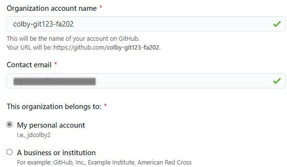
* Click **Next**.
* The next page prompts you for members; These will be students and TAs associated with the course. If you have their GitHub account names, you can populate the field now. If not, you can have the students connect to this organization account later.
* In the next page, you may be asked to complete a survey before proceeding. You might also be asked if you have an **existing repository for this project**. Select **No** for now. Click **Submit** to continue.
* The next page will be your course repository landing page.  This will be where you will create assignment repo templates for this course.
  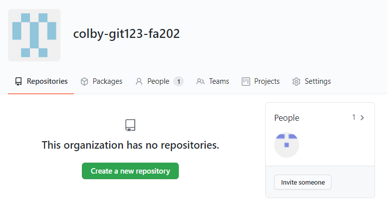

If you added a list of students to the organization in an earlier step, you will see the list of students under the **People** tab. If not, you should just see yourself under that tab.

### Inviting students to your course organization

If you did not pre-populate the course organization with student account names (a likely scenario given that you may opt to create the course organization before the start of the semester), you can send an **invite** to your students. 

* Ask students to create a GitHub account (if they do not have one yet), and have them email you their GitHub account names.

* Send the students an **Invite** via the **Invite someone** link. When prompted for a role, you'll probably want to assign them as **Members**. 
  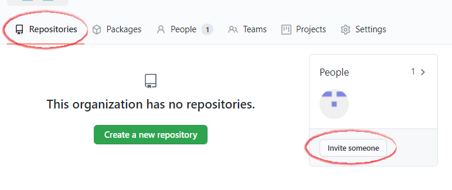
  
* Once the *Invites* are sent, students will need to check their email inbox for the invitation.
  

Once a student has accepted the invite, that student's account name should appear under the **People**'s tab.
  

### Creating your GitHub Classroom

This next step makes use of GitHub's Classroom. This is the environment that you will use to manage student assignment repos and to create teams for group activity.

* Point your browser to https://classroom.github.com/. If prompted to log in, do so using your GitHub account.
* If this is your first time using *Classroom*, you will be prompted to create **Your first classroom**.
* On the next page, you will be asked to select the course organizational account that you will be working with.
  
* On the next page, give your classroom a name (this can be the same as the organizational account created earlier).
  
* On the next page, you can invite TAs or other instructors that may need admin access to this classroom.  Click **Continue** when done.
* If you have a list of student GitHub account names, you can add them at the bottom of the page. If not, you can invite the students later. Click **Continue** when done.

At this point, you will see your GitHub classroom landing page. This is a one time operation. You will want to note and bookmark the following:

* Your **GitHub organization** page (e.g. [https://github.com/colby-git123-fa2021/](https://github.com/colby-git123-fa2021/) in this working example);
* Your **GitHub Classroom** page ([https://classroom.github.com/classrooms](https://classroom.github.com/classrooms)).

You will want to share the **GitHub organization** link with your students as well. But note that the students will only see their own assignments and *not* those of their peers. 

## Creating a new assignment

The course organizational account and classroom setup is a one time operation. For the duration of the semester, assignments/projects will be created using the following steps:

+ Create an assignment/project repo template in your course **Organizational account**.
+ Share the assignment repo with your students via the **GitHub Classroom portal**.

A sample workflow follows:

### Creating an assignment repo template

* Navigate to your **GitHub page**.

* In the upper right-hand corner of the page, click on your avatar and select **Your organizations**.
  

* You should see your course organization listed. Select it.
  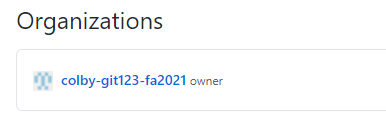

* If this is the first time creating a new repo, click on **Create a new repository**.
  

* If you already have existing repos, click on the **New** button.
  

* Give this repo a name, e.g. `HW01`. You'll probably want to keep this repo private (i.e. only accessible to your classroom organization). You'll also want to create a README file that will provide students with assignment instructions.
  

* Click **Create repository** to proceed.

* This will bring up the new assignment repository. You can modify this repo as you would any other repo via the GitHub interface, or by cloning to your local computer then pushing back to GitHub.

* Once you've created your assignment repo, you will need to convert it to a template. Doing so will allow students to clone this assignment in their own GitHub account.

  Click on the **Settings** tab, the check **Template repository**.
  

  

### Sharing the assignment repo via Classroom

* Navigate to https://classroom.github.com/ and log in using your GitHub user account.

* Select your classroom.
  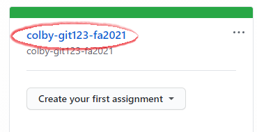
  
* If this is the first adding an assignment to Classroom click on **Create an Assignment**.
  

* Assign a name to this assignment. It can be the same  name as that created in the Organization account. You can stick with the other defaults if this is an individual assignment. Click **Continue**.
  
  
* Next, assign a repo template to this Classroom assignment. Do so by clicking on the **Select a repository** pull-down menu and start typing the first few letters of your Organization repo name (in this example, we start typing `colby-` at which point our `colby-git-fa2021/HW01` should pop up. It may take a few seconds before GitHub lists all repo names starting with `colby-`.
  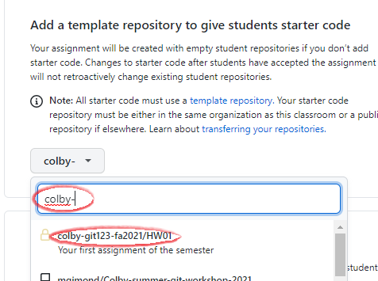
  
  If you do not see the homework repo listed, its possible that you did not check off the *Template repository* option in an earlier step.
  
* Click **Continue**.

* We will not add auto-grading features, so we can click on the **Create assignment** button.

The Classroom assignment is ready. Note the link to this assignment. 

  

This is the link that you will share with your students via a course management system such as Moodle.  This link will create a clone from your `HW01` template for each student. Student instructions follow.

### Steps to be completed by the student

1. Log into your student GitHub account.
2. Clone the repo  template to your GitHub account by typing or copying/pasting the GitHub Classroom link. Using this working example, the link would be: https://classroom.github.com/a/jWPc0wCj
3. If your account has already been added to the Classroom account, click on **Accept this assignment**.
   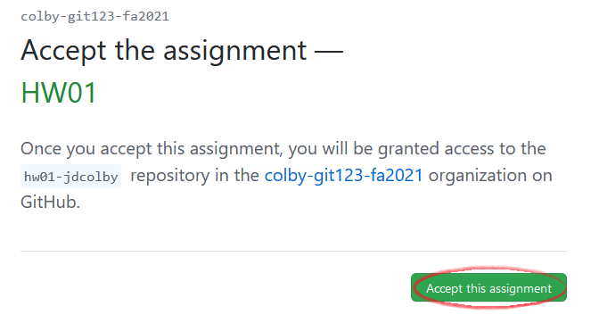
4. You may need to wait a few seconds before the repo is copied to your personal account. You might have to refresh the page to see the link to your repo. 
   In the following example, the repo was cloned by `jdcolby` hence the repo name `hw01-jdcolby`. Your repo should reflect your account name.
   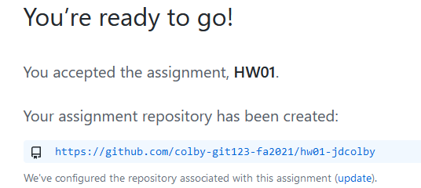
5. Click on the repo link. This will bring you to your own version of the `hw01` repo. Any changes you make to this repo are yours and yours alone.

## Accessing student assignment repos

To access *all* student assignments, navigate to your course's **Organizational** page and *not* the Classroom page.  Here, you will see your assignment templates (e.g. `HW01`) and you students' work with a repo name that concatenates the repo template with the student's GitHub use account name (e.g. `hw01-jdcolby`)

 

## Creating team assignments

Students can be assigned to **teams** whereby all team members have read-write access to the same assignment repo.  

### Instructor's steps

* The first step involves creating an assignment under the course's organizational account as was demonstrated in an earlier exercise.
* The next step is to setup the Classroom assignment. Point your browser to to https://classroom.github.com/ then select your course's classroom.
  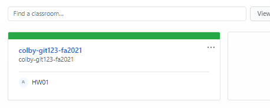
* Create a new assignment.
* In this example, we'll name it `grp_hw02` and change the settings to **Group assignment**. If you plan to recycle the set of teams for future assignments, you might want to assign a meaningful name to this set of teams. You can also define the maximum number of teams and team members.
   

* On the next page, you will be prompted to select the **template repository** as was done in an earlier exercise. From there, adopt the default settings.  This will generate a new link for this group assignment that you will share with your students.

  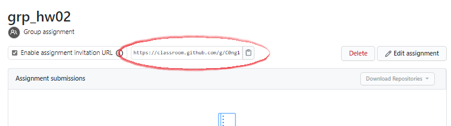 

In addition to providing the students with the group assignment link, you will need to assign them a team name (it will be created by the students when they clone the rep)

  ### Student's steps
* Navigate to the GitHub classroom provided link

  * If the student's assigned team has **not** been created, it will not show up on the page. She will need to type in her team name. For example, if she is assigned Team01, she would type `team01` in the empty field.
    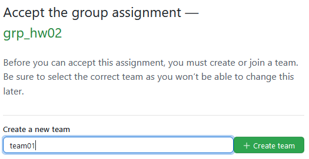

    The next step is to accept the assignment in which case the team repo is created.

  * If the student's assigned team has  been created, she simply needs to click on the team name's **Join** button.
    

    The next step is to accept the assignment in which case the student is assigned co-authorship of the repo.

-----

[Back to the home page](index.html)

  Manny Gimond (2021)
 

