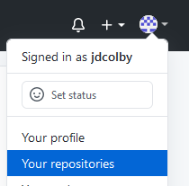
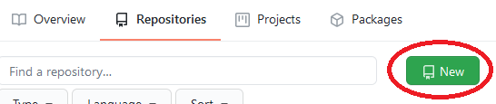
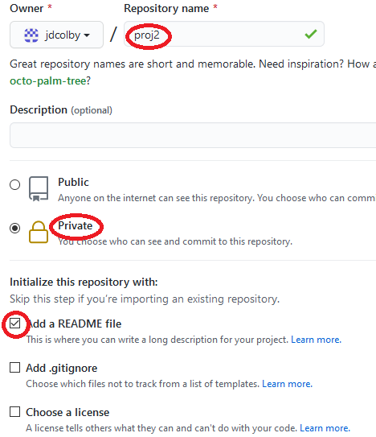
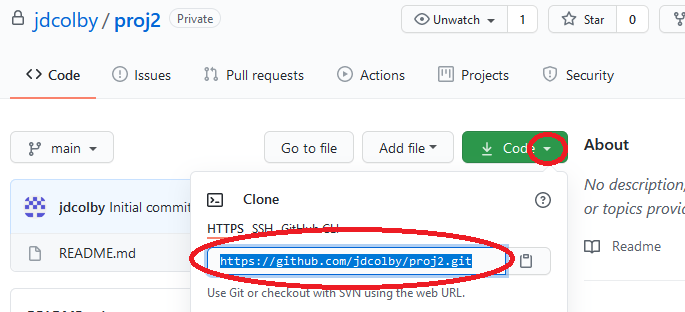
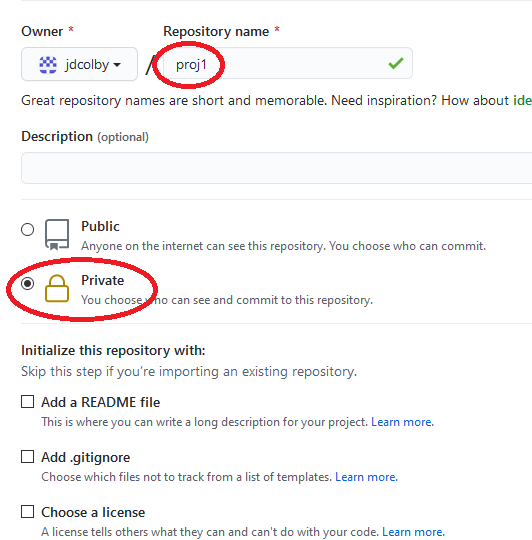
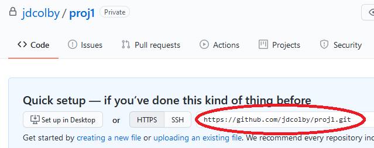
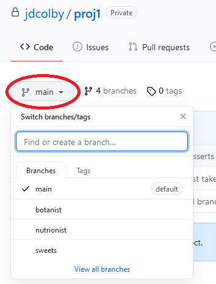

# Linking GitHub to a local repo

In this tutorial, we will explore two scenarios.

* Scenario 1: This is the **simplest** case scenario whereby a new repo will be created on GitHub, then cloned as a new folder on your local desktop.
* Scenario 2: This is a more **complicated** scenario whereby a new repo will be created on GitHub at which point an existing desktop repo will be pushed to this newly created repo.

## Scenario 1

### Create a new repo in GitHub

* In a web browser, point the browser to https://github.com. Make sure that you are logged into your account.

* In the upper right-hand corner, click on your avatar and select **Your repositories**.
  
  
  This will list any repos created in your GitHub account. If you just created a GitHub account, the repo will be empty. 
  
* Click on the **New** button to create a new repo.
  

* Name this repo **proj2**, make it **private** (if you don't want this repo to be made publicly available) and add a **README** file. A README file is a default document used to provide basic information about the repo. This file is not needed for the functionality of git, but it's good practice to have one in each repo in your account.
 
* Click on the **Create repository** at the bottom of the page.

The new repo is now created.

### Cloning `proj2` onto your computer

The next step is to clone your GitHub repo onto your personal computer. The act of *cloning* creates an exact copy of the GitHub repository.

* First, you need to get the web address of your newly create repo. Do so by clicking on the green **Code** button, then copying the web link. It should end with `.git`.
 

* Next, switch to your Bash shell on your local  computer and navigate to the folder that will house the newly created repo. 
  - To change folder use the `cd` command, e.g. `cd jdcolby`.
  - To move up one folder level use the `cd ..` command (note the two dots `..`). 
  - To list the current path use the `pwd` command.
* Clone the repo using the `git clone <repo link>` command. For example:
  
  `git clone https://github.com/jdcolby/proj2.git`
  
  At this point you will be presented with a few login options depending on the OS and git version being used. For example, on Windows using  Git version `2.31.1` you will have the option to authenticate using a token or a *GitCredentialManager*. 

> NOTE: As of August 2021, GitHub will no longer allow account password authentication when accessing a GitHub account using Git. Instead, you will be required to use personal access token or SSH based authentication. This page will be updated later this summer with token based instructions for connecting to GitHub with Git.

At this point, you should have a complete copy of the GitHub repo as a new folder. Note that you are not automatically placed into the new folder. Running `ls -aF` should show the `proj2` folder.

```BASH
$ ls -aF
```

```
./  ../  proj1/  proj2/
```

Switch directory to `proj2`.

```BASH
$ cd proj2
$ ls -aF
```

```
./  ../  .git/  README.md
```

You'll note that Git added the `.git` hidden folder to the repo. 


## Scenario 2

In this scenario, we will create a new repo on GitHub, then connect that repo to an existing folder on our computer.

### Create a new repo in GitHub
We adopt the same instructions listed in *Scenario 1* to create a new GitHub repo, however, this time we will not have GitHub create the README file. This will ensure that the repo is completely empty. Name the new repo `proj1`. Note that we are choosing to assign it the same name as the project folder on our computer out of convenience, but the repo name does not need to match the project folder name.



Once created, we will be sent to a page with the `.git` link. Copy this link in your clipboard, you will need it in the next section.



### Link your local repo to the GitHub repo

The first step requires creating a **handle** in our local repo that will point to the GitHub repo. 

In a Bash shell, navigate to your existing repo folder and type the following command:

```BASH
$ git remote add origin https://github.com/jdcolby/proj1.git
```

This command creates an alias, `origin`, that, when called, will reference the GitHub repo.

Next, you will learn how to upload (aka **push**) your local repo to GitHub.

### Push your local repo to GitHub

To push the current branch, `main`, to GitHub, type:

```BASH
$ git push origin main
```

To push *all* local branches to GitHub, type:

```BASH
$ git push origin --all
```

Note that if you do not have a personal access token setup on your local computer, you might be prompted  for a username and password (this option will only be available until August 2021).

**Refresh** your GitHub `proj1`  repo. It should now be populated with all the files and folders present in your local repo.

You can switch between branches on GitHub via the **branch** tab.

You won't see the `.git/` folder on the GitHub repo, that's because GitHub has its own Git system. However, all versions and logs stored in your local `.git/` folder do get synced with the GitHub repo.

<div class="footer">
<hr/>
<a rel="license" href="https://creativecommons.org/licenses/by-nc/4.0/"></a>  Manny Gimond (2021)
</br>